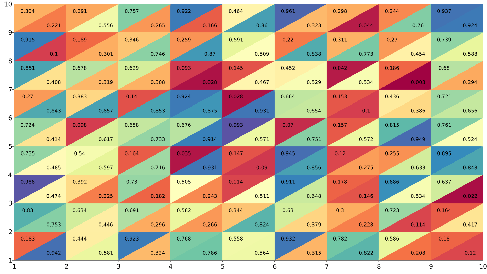

# GLMakie-Split-Heatmap

This project uses the GLMakie package in Julia to generate and visualize split heatmaps. The code efficiently creates heatmaps by splitting data into segments, allowing for customized and detailed visualization.
We can now plot two matrices in one figure.

## Features 
- Split heatmaps for detailed data visualization.
- Customizable color schemes, segmentations, and layouts.
- Fast rendering using the GLMakie backend for interactive and high-quality graphics.

## Prerequisites
Before running the code, make sure you have the following dependencies installed:
- Julia (version 1.11 or higher)
- Required package:
- - GLMakie.jl

To install the required packages, you can run:

```bash
using Pkg
Pkg.add("GLMakie")
```

## How to Use
1. Clone this repository:
```bash
git clone https://github.com/fuofuo-gg/GLMakie-Split-Heatmap
cd GLMakie-Split-Heatmap
```
2.Run the Julia script:
```bash
julia GLMakieSplitHeatmap.jl
```
3.Customize the heatmap generation by modifying the script:
  - Adjust the data segmentation parameters.
  - Choose your color scheme and heatmap layout options.

## Example Output
Below is an example of the kind of split heatmap generated by the script:


## License
This project is licensed under the MIT License - see the [LICENSE](LICENSE) file for details.
